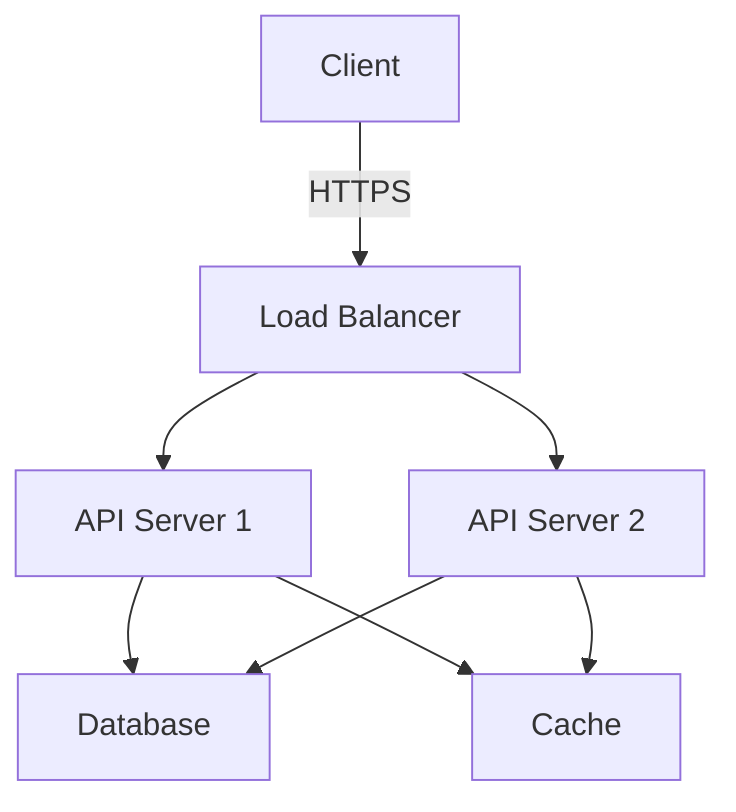
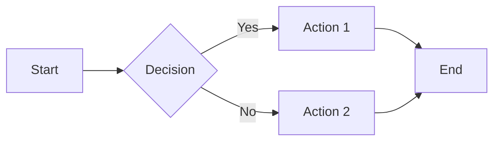
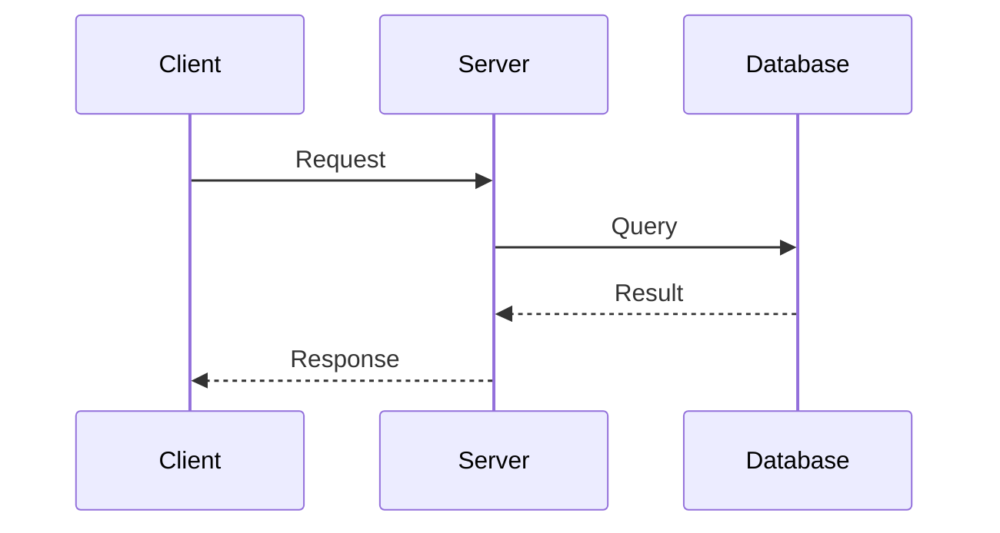

# Markdown Mastery Solution

## Step-by-Step Solution

### Task 1: Create a Comprehensive Project README

**Step 1: Start with structure**
```markdown
# Project Name

## Overview
Brief description of the project

## Features
- Key feature 1
- Key feature 2

## Installation
```bash
npm install project-name
```

## Usage
Basic usage examples

## API Reference
Detailed API documentation

## Contributing
How to contribute

## License
License information
```

**Step 2: Ask Claude to enhance**
```
"I've created a basic README structure. Can you:
1. Add appropriate badges for build status, coverage, and version
2. Enhance the Features section with more detail
3. Add a table of contents with anchor links
4. Suggest what sections I might be missing"
```

**Step 3: Add visual elements**
```markdown
## Comparison

| Feature | Our Solution | Competitor A | Competitor B |
|---------|--------------|--------------|--------------|
| Speed   | ✅ Fast      | ⚠️ Medium    | ❌ Slow      |
| Price   | $$          | $$$          | $           |
| Support | 24/7        | Business hrs | Email only  |
```

### Task 2: Build a Technical Specification

**Step 1: Create the outline**
```markdown
# Technical Specification: User Authentication System

## 1. Overview
## 2. Requirements
### 2.1 Functional Requirements
### 2.2 Non-Functional Requirements
## 3. Architecture
## 4. API Specification
## 5. Data Models
## 6. Security Considerations
## 7. Testing Strategy
```

**Step 2: Add diagrams with Mermaid**
```markdown
## Architecture Diagram


```

**Step 3: Document API endpoints**
```markdown
## API Endpoints

### POST /api/auth/login

Authenticates a user and returns a JWT token.

**Request:**
```json
{
  "email": "user@example.com",
  "password": "securePassword123"
}
```

**Response:**
```json
{
  "token": "eyJhbGciOiJIUzI1NiIsInR5cCI6IkpXVCJ9...",
  "user": {
    "id": "123",
    "email": "user@example.com",
    "name": "John Doe"
  }
}
```

**Error Responses:**
- `400 Bad Request` - Invalid input
- `401 Unauthorized` - Invalid credentials
- `429 Too Many Requests` - Rate limit exceeded
```

### Task 3: Generate a Knowledge Base

**Step 1: Create index file**
```markdown
# Documentation Index

## Getting Started
- [Installation Guide](./guides/installation.md)
- [Quick Start](./guides/quickstart.md)
- [Configuration](./guides/configuration.md)

## Core Concepts
- [Authentication](./concepts/authentication.md)
- [Data Models](./concepts/data-models.md)
- [API Design](./concepts/api-design.md)

## Tutorials
- [Building Your First App](./tutorials/first-app.md)
- [Advanced Features](./tutorials/advanced.md)

## Reference
- [API Reference](./reference/api.md)
- [Configuration Options](./reference/config.md)
- [Error Codes](./reference/errors.md)
```

**Step 2: Create interconnected documents**
```markdown
# Authentication

> See also: [Security Best Practices](./security.md)

## Overview
Authentication is the process of verifying user identity.

## Supported Methods
1. [JWT Tokens](#jwt-tokens)
2. [OAuth 2.0](#oauth)
3. [API Keys](#api-keys)

## JWT Tokens
Learn more in our [JWT Implementation Guide](./guides/jwt.md).

---
**Next:** [Authorization](./authorization.md)
```

### Task 4: Format Complex Data

**Step 1: Convert JSON to table**
```
"I have this JSON array of user data. Can you convert it into a Markdown table?

[JSON data]
"
```

**Result:**
```markdown
| ID  | Name          | Email                | Role  | Status |
|-----|---------------|----------------------|-------|--------|
| 001 | Alice Johnson | alice@example.com    | Admin | Active |
| 002 | Bob Smith     | bob@example.com      | User  | Active |
| 003 | Carol White   | carol@example.com    | User  | Inactive |
```

**Step 2: Use collapsible sections**
```markdown
<details>
<summary>Click to see detailed implementation</summary>

```typescript
function authenticateUser(credentials: Credentials): Promise<AuthResult> {
  // Detailed implementation here
  // This stays hidden until user clicks
}
```

This implementation includes:
- Rate limiting
- Password hashing with bcrypt
- JWT token generation
- Refresh token rotation

</details>
```

## Example Commands and Techniques

### Working with Code Blocks

**Multiple languages:**
```markdown
JavaScript implementation:
```javascript
const result = await fetch('/api/data');
```

Python equivalent:
```python
result = requests.get('/api/data')
```

Bash command:
```bash
curl https://api.example.com/data
```
```

### Creating Effective Tables

**Basic table:**
```markdown
| Header 1 | Header 2 | Header 3 |
|----------|----------|----------|
| Cell 1   | Cell 2   | Cell 3   |
```

**Aligned table:**
```markdown
| Left Align | Center Align | Right Align |
|:-----------|:------------:|-----------:|
| Text       | Text         | Text       |
```

### Task Lists

```markdown
## Implementation Checklist

- [x] Set up project structure
- [x] Implement authentication
- [ ] Add user dashboard
- [ ] Write tests
  - [x] Unit tests
  - [ ] Integration tests
  - [ ] E2E tests
```

### Callouts and Admonitions

```markdown
> **Note:** This is important information.

> **Warning:** This action cannot be undone.

> **Tip:** Use keyboard shortcuts for faster navigation.
```

## Common Mistakes to Avoid

### 1. Inconsistent Header Hierarchy
**Wrong:**
```markdown
# Title
### Skipped H2
## Going back to H2
```

**Right:**
```markdown
# Title
## Section 1
### Subsection 1.1
## Section 2
```

### 2. Missing Language Specifiers
**Wrong:**
```markdown
```
function example() {
  return true;
}
```
```

**Right:**
```markdown
```javascript
function example() {
  return true;
}
```
```

### 3. Broken Links
**Wrong:**
```markdown
See the [documentation](docs/guide.md)
```
(File doesn't exist)

**Right:**
```markdown
See the [documentation](./docs/guide.md)
```
(Verify file exists)

### 4. Poor Table Formatting
**Wrong:**
```markdown
| Header1 | Header2|Header3|
|---|---| ---|
|Data|More Data|Even More|
```

**Right:**
```markdown
| Header 1   | Header 2    | Header 3       |
|------------|-------------|----------------|
| Data       | More Data   | Even More Data |
```

### 5. Not Using Semantic Structure
**Wrong:**
Using bold text instead of headers for sections.

**Right:**
Using proper header hierarchy for document structure.

## Best Practices

### 1. Use Semantic Headers
```markdown
# Document Title (H1) - Only one per document
## Major Sections (H2)
### Subsections (H3)
#### Details (H4)
```

### 2. Code Block Best Practices
```markdown
```language:filename.ext
// Always specify language
// Optionally specify filename
const example = "code";
```
```

### 3. Link Management
```markdown
<!-- Internal links -->
[Section](#section-name)

<!-- Relative links -->
[Other doc](./other.md)

<!-- External links -->
[External](https://example.com)

<!-- Reference-style links -->
[link-text][link-id]

[link-id]: https://example.com "Optional Title"
```

### 4. Lists Best Practices
```markdown
<!-- Unordered lists -->
- Item 1
  - Nested item
  - Another nested item
- Item 2

<!-- Ordered lists -->
1. First step
2. Second step
   1. Sub-step
   2. Another sub-step
3. Third step

<!-- Mixed lists -->
1. Ordered item
   - Unordered sub-item
   - Another sub-item
2. Next ordered item
```

### 5. Emphasis and Formatting
```markdown
*Italic* or _italic_
**Bold** or __bold__
***Bold and italic***
`Inline code`
~~Strikethrough~~
```

## Advanced Techniques

### Mermaid Diagrams

**Flowchart:**
```markdown

```

**Sequence Diagram:**
```markdown

```

### Frontmatter for Metadata
```markdown
---
title: "Document Title"
author: "Your Name"
date: 2026-01-21
tags: [documentation, markdown, tutorial]
---

# Document Content
```

### HTML in Markdown
```markdown
<!-- When Markdown isn't enough -->
<div align="center">
  
  <h1>Centered Title</h1>
</div>

<!-- Collapsible sections -->
<details>
<summary>Advanced Options</summary>
Content here
</details>
```

### Working with Claude

**Ask for structure:**
```
"I need to document a REST API. Can you create a Markdown template that includes
sections for authentication, endpoints, rate limiting, and error handling?"
```

**Ask for conversion:**
```
"Convert this unstructured text into a properly formatted Markdown document with
appropriate headers, lists, and code blocks."
```

**Ask for enhancement:**
```
"Review this Markdown document and suggest improvements to:
1. Header hierarchy
2. Code block formatting
3. Table readability
4. Link organization"
```

## Success Indicators

You've mastered this challenge when you can:
- Create well-structured Markdown documents from scratch
- Use appropriate formatting for different content types
- Leverage Claude to generate and refine Markdown
- Navigate and maintain large Markdown-based documentation
- Choose the right Markdown features for each use case
- Create reusable templates and patterns
