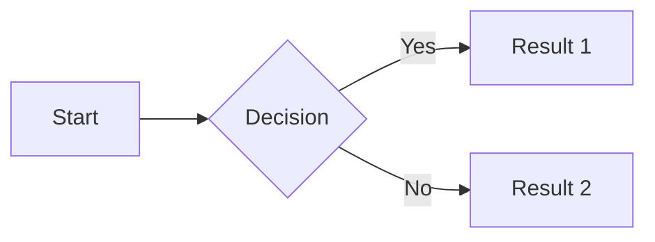

# Walkthrough: Markdown Mastery

**Difficulty:** Easy | **Time:** 12 minutes | **Category:** Advanced Orchestration

---

## Overview

Markdown is the universal format for developer communication. Claude understands and generates Markdown perfectly. This challenge teaches you to leverage Markdown effectively in your Claude workflows.

## Prerequisites

- [ ] Basic Markdown knowledge
- [ ] Editor with Markdown preview
- [ ] Content to format

---

## Step 1: Why Markdown with Claude

### Claude + Markdown = Perfect Match
```
1. Claude outputs Markdown naturally
2. Markdown is readable as plain text
3. Renders beautifully in GitHub, Notion, etc.
4. Easy to version control
5. Converts to HTML, PDF, slides
```

---

## Step 2: Essential Markdown

### Quick Reference
```markdown
# Heading 1
## Heading 2
### Heading 3

**bold** and *italic* and `code`

- Bullet point
- Another point
  - Nested point

1. Numbered
2. List

[Link text](https://url.com)


> Blockquote

---

| Header | Header |
|--------|--------|
| Cell   | Cell   |

```code
language
```
```

---

## Step 3: Documentation Patterns

### API Endpoint
```markdown
## Create User

`POST /api/users`

Creates a new user account.

### Request

| Parameter | Type | Required | Description |
|-----------|------|----------|-------------|
| email | string | Yes | User's email |
| password | string | Yes | Min 8 characters |
| name | string | No | Display name |

### Response

```json
{
  "id": "user_123",
  "email": "user@example.com",
  "created_at": "2024-01-15T10:00:00Z"
}
```

### Errors

| Code | Description |
|------|-------------|
| 400 | Invalid input |
| 409 | Email already exists |
```

### README Structure
```markdown
# Project Name

Brief description of what this project does.

## Quick Start

```bash
npm install project-name
project-name init
```

## Features

- Feature one with benefit
- Feature two with benefit
- Feature three with benefit

## Documentation

- [Getting Started](docs/getting-started.md)
- [API Reference](docs/api.md)
- [Examples](examples/)

## Contributing

See [CONTRIBUTING.md](CONTRIBUTING.md)

## License

MIT
```

---

## Step 4: Claude Output Formatting

### Ask for Structured Output
```
Create a comparison of React vs Vue with:
- Table comparing features
- Pros/cons lists for each
- Decision flowchart in text
- Recommendation summary

Format as clean Markdown.
```

### Specify Format Requirements
```
Document this function in Markdown:
- H2 for function name
- Brief description
- Parameters table
- Return value section
- Code example in JavaScript
- Notes section if needed
```

---

## Step 5: Advanced Markdown

### Collapsible Sections (GitHub)
```markdown
<details>
<summary>Click to expand</summary>

Hidden content here.
- Works on GitHub
- Great for long content
- Keeps docs clean

</details>
```

### Task Lists
```markdown
## Todo

- [x] Completed task
- [ ] Pending task
- [ ] Another pending task
```

### Diagrams (Mermaid)
```markdown

```

### Alerts (GitHub)
```markdown
> [!NOTE]
> Important information

> [!WARNING]
> Be careful about this

> [!TIP]
> Helpful suggestion
```

---

## Step 6: Markdown Workflows

### From Code to Docs
```
Generate Markdown documentation for this TypeScript file:
[paste code]

Include:
- Module overview
- Exported functions/classes
- Usage examples
- Type definitions
```

### From Conversation to Document
```
Based on our discussion, create a Markdown spec document with:
- Summary of decisions
- Technical requirements
- Open questions
- Next steps
```

---

## Verification Checklist

- [ ] Created documentation in Markdown
- [ ] Used tables effectively
- [ ] Used code blocks with language hints
- [ ] Created a structured README
- [ ] Used advanced features (collapsible, task lists)

---

## Markdown Quick Reference

| Element | Syntax |
|---------|--------|
| Bold | `**text**` |
| Italic | `*text*` |
| Code | `` `code` `` |
| Link | `[text](url)` |
| Image | `` |
| Header | `# H1` to `###### H6` |
| List | `- item` or `1. item` |
| Quote | `> text` |
| Table | `| h | h |` |
| Divider | `---` |

---

## Common Pitfalls

| Issue | Solution |
|-------|----------|
| Tables not rendering | Ensure header separator row |
| Code not highlighted | Add language after ``` |
| Links broken | Check for spaces in URLs |
| Nested lists wrong | Use consistent indentation |

---

## Pro Tips

1. **Preview Often:** Check rendering as you write
2. **Language Tags:** Always specify code block language
3. **Consistent Style:** Pick conventions, stick to them
4. **Portable:** Test in target platform (GitHub, Notion, etc.)

---

## Next Challenge

Continue to **[Container Sandbox](./03-container-sandbox.md)** for safe execution environments!
